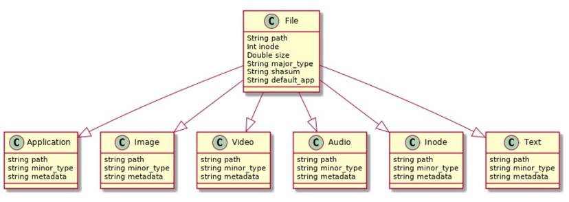
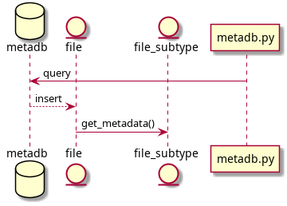
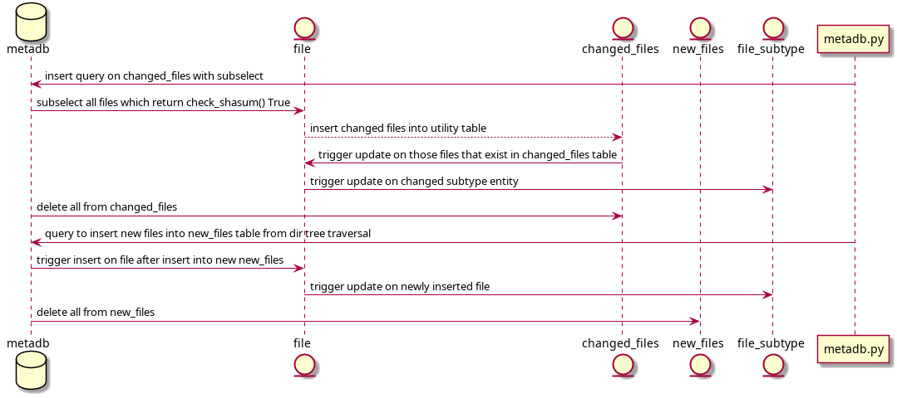
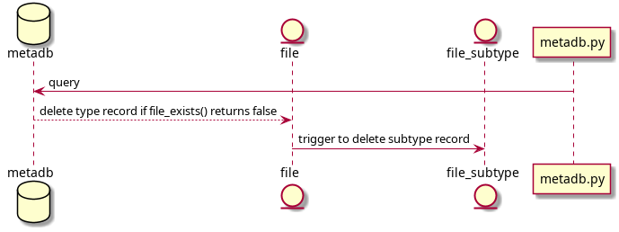

### Meta-DB Database Requirements
Authors: Tian Liu, Sergiy Kolodyazhnyy, Jericha Bradley

Course: CS3810

Instructor: Salim Lakhani

---

## Contents
1. Introduction
   1. Purpose and Objectives
   2. Assumptions and Dependencies
2. Architecture
    1. Overview of the Database Architecture
    2. Software Dependencies
    3. Hardware Dependencies
    4. Limitations and Constraints
3. Database Model
    1. Overview of Entities
    2. Required Tables
4. Database-User Interfacing
    1. Information Flow
    2. Common User Queries

## 1. Introduction
### 1.1 Purpose and Objectives

The goals of this application:
- to provide a convenient way for users to search for files based on particular metadata
- to provide a convenient way for users to show metadata of specific files
- to provide a more powerful alternative to the standard locatedb on Linux/Unix systems

The application aims at desktop use, however the application suits well for server environment as well. In such environments as file storage/archiving or file sharing service the application provides means to locate particular file on a more fine-grained sets of requirements. In the image/audio processing environment where multiple files and encoding types frequently have to coexist, the application can provide means of better control over indexing the processed data. The application can be used as standalone command as well as in scripting applications, where information written to stdout stream may be redirected to other applications via standard unix pipelines or temporary files.

### 1.2 Assumptions and Dependencies

The core assumptions of this applications are:
- the application is used within Linux environment
- the required modules for determining filetypes and their metadata are installed

## 2. Architecture
### 2.1 Overview of the Database Architecture

The application should perform 4 core functionalities:
- load file and corresponding metadata information
- vacuum ( i.e. remove ) the file entires out of the database whose path no longer exists on the filesystem. While the file itself may exist on the filesystem, its path makes it no longer a valid entry
- update the database - records of files which have been changed ( based on shasum ) should be updated and newly added files to the filesystem should added to the database
- perform user-defined search queries based on minimal set of criteria

In order to speed up search queries, the database takes advantage of indexes. In order to maximize performance, indexes generally should be created on columns with high cardinality ( i.e. uniqueness of data). In case of the `file` table highest cardinality can be achieved either via shasum or path. While searching based on shasum is rare for average desktop users, path string would be more frequent and logical. Within each subtype highest cardinality is again achieved via path of the file. Indexes can help even in low cardinality cases, such as when we only have very few Image records with minor type `png`. For these reasons, the database will have the following indexes:

- `file_path` index
- `subtype_minor_type` index for each subtype
- `metadata` index for each subtype

Modeling via supertypes and subtype is used to model the relationship between files and their metadata. This is further described in  section 3.

### 2.2 Software Dependencies

Primary software used within this application:
- SQLite 3
- Python 3

Since the SQLite is intended for data aggregation and incapable of implementing system functions needed for the data discovery, such as traversing the directory tree for each user directory or discovering metadata for particular file, the bulk of the job is done by Python 3 modules. In particular, the following modules are necessary:

- `PIL` for image metadata discovery
- `os` for directory tree traversal and basic OS interfacing
- `audioread` for audiofile metadata discovery
- `subprocess` to take advantage of external commands
- `OrderedDict` to create json string with consistent order of items for performance benefits


### 2.3 Hardware Dependencies

### 2.4 Limitations and Constraints

The choice of the database software for this project influences the constraints on how SQL code will be structured. For instance, SQLite does not support conditional triggers. However, it is possible to implement conditional trigger via multiple triggers that fire when single specific condition is met. For instance, where in MySQL we could do

```SQL
CREATE TRIGGER record_type AFTER INSERT ON file
FOR EACH ROW BEGIN
    IF (New.filetype = 'text') THEN
        INSERT INTO text_file (path) VALUES ( New.path );
    ELSE IF (New.filetype = 'image') THEN
        INSERT INTO image_file (path) VALUES  (New.path);
    END IF;
END;
```

in SQL we will have to split this into two triggers as so

```SQL
    CREATE TRIGGER record_text AFTER INSERT ON file
    WHEN New.filetype = 'text'
    BEGIN
        INSERT INTO text_file   (path) VALUES (New.path);
    END;

    CREATE TRIGGER record_image AFTER INSERT ON file
    WHEN New.filetype = 'text'
    BEGIN
        INSERT INTO image_file (path) VALUES (New.path);
    END;

```

Additionally, SQLite does not have stored procedures, which is a conscious choice on SQLite developer's side. The core idea is to offset functional and procedural capabilities onto the application's language. For that purpose, SQLite allows creating user-defined functions and connecting them with the database from within the host language. In particular, we will need to create several Python functions to be used from within the database itself, such as `check_shasum()`, `file_exists()`, and metadata-specific functions such as `get_exif()` to return exif information for jpeg files.


## 3. Database Model

The database models files and relation with their metadata via inheritance model. All objects that are discovered by the application via traversal of the  user's directories are going to be files, but each file has particular 'is a' relationship with major filetype.  Natural key to uniquely identify a file is pathname, which will be used as both primary key and foreign key to link entities.


The major supertype in `file` table contains common information for all files, such as full filesystem path to file, access and modification time, inode number. Since metadata varies between different types of files ( obviously  metadata for image files is different from textfiles), subtype entity inherits pathname from the supertype. Metadata itself can be complex and varied within the subtype domain itself. Thus in order to reduce complexity, the metadata will be stored as json string. The advantage of such approach is that the command-line front end written in Python can convert json string to Python's native dictionary datastructure. This reduces complexity on the SQL side of the development.

### 3.1 Overview of Entities




### 3.2 Required Tables

For entity relationship:

- File, supertypes
- text
- applications
- image
- video
- audio
- inode


## 4. Database-User Interfacing

The application is written as command-line application, which implies the application can interface with the user via text. The user can control which database queries are issued via command-line switches such as `-l`, `-u`, `-v`

### 4.1 Information Flow

`load` functionality:



`update` functionality:



`vacuum` functionality:



### 4.2 Common User Queries

Application is aimed at providing metadata searching capability. Core cases are 1) user providing specific file to retrieve from database and 2) user wants to find a particular type of file with specific metadata.

## 5. Future Considerations and Extending

- While the application's core aim is to provide metadata aggregation and lookup, the database is capable of additional functionality which may be potentially considered in future releases. As the demands of the users of the application grow, the users may require new sets of features. In particular, common complain of the desktop users within Linux ecosystem is the lack of tagging for files and searching based on the tags. The SQLite database is very much suitable for such purpose, and such feature may be added in future. Such feature would extend the database from supporting aggregation of metadata attached to the files themselves to providing capability of aggregating user-defined metadata.

- Further performance improvements could be achieved via leveraging Python's regex searching capabilities in parsing the json metadata strings.
